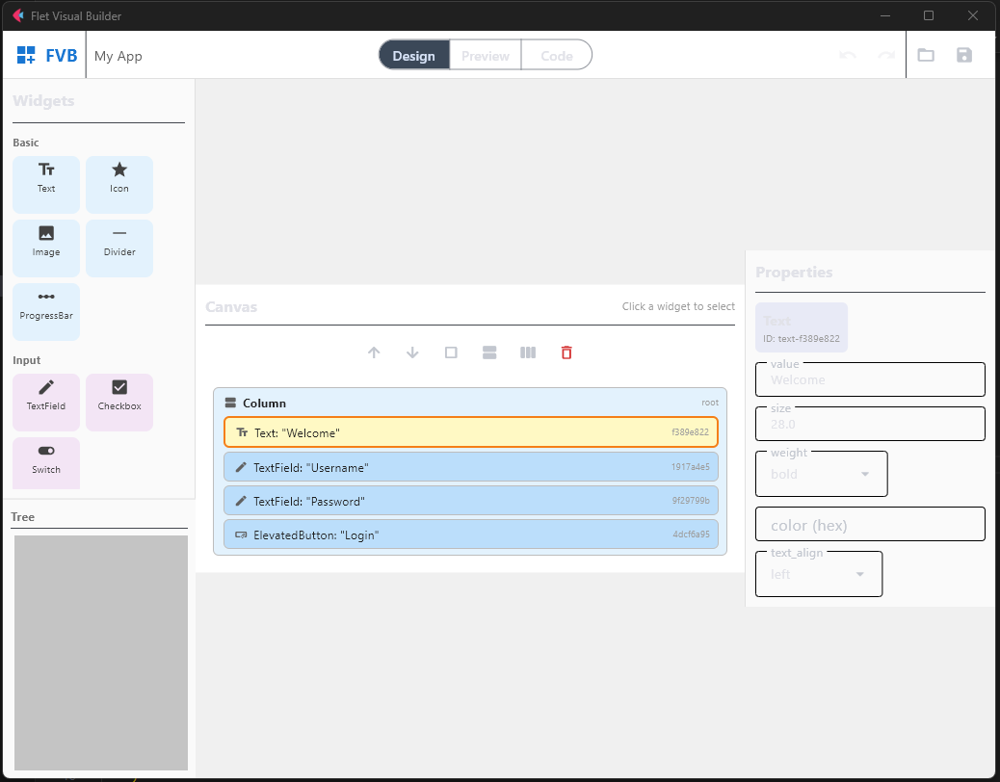
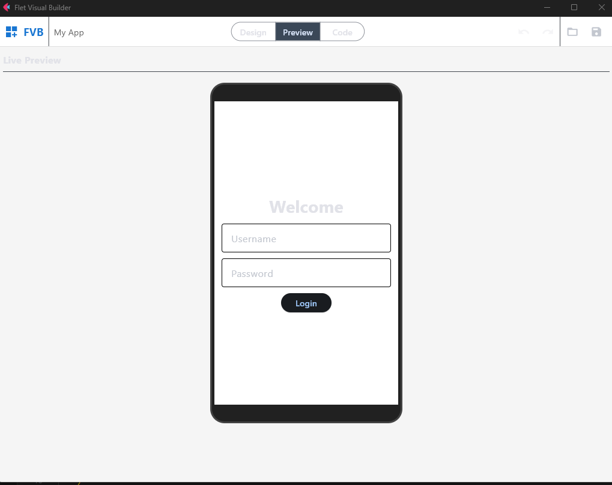
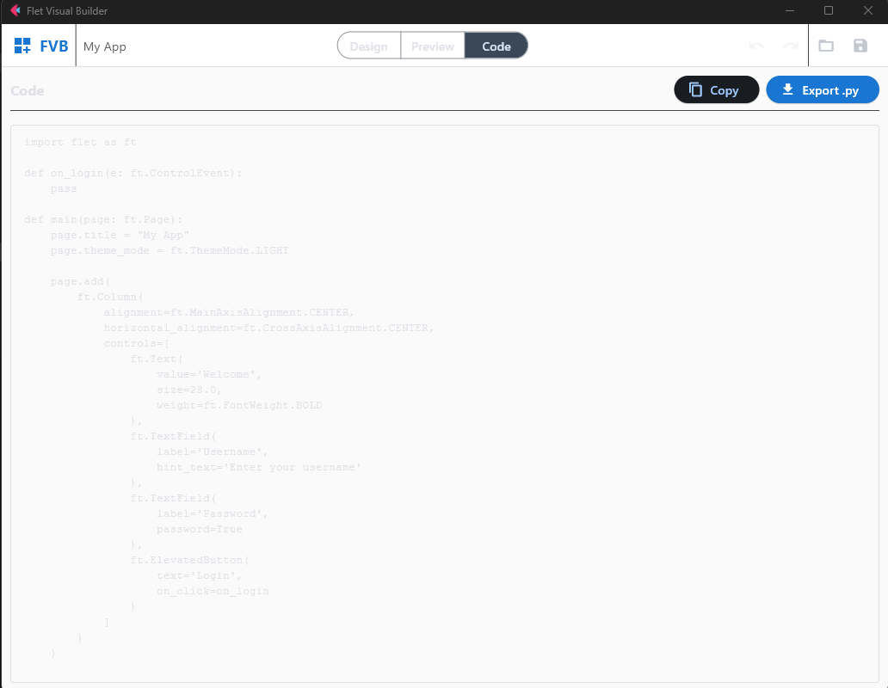

# Flet Visual Builder

Flet Visual Builder (FVB) is a drag-and-drop UI builder for Flet apps.

> ⚠️ **Disclaimer:** This project is currently experimental and can be **very buggy**.  
> Some widgets and preview behavior may break depending on the installed Flet version.
>
> ⚠️ **Vibe Code Alert:** This project was 99% vibe coded as a fun long weekend hack.


## Current MVP foundation

This repository includes the core architecture required by the TDD:

- Widget tree model (`WidgetNode`) with slot-aware children
- Widget registry and centralized enum mapping
- Tree operations (insert/delete/move/reorder/wrap) with cycle prevention
- Validation engine for export safety (including slot checking)
- Code generation (`WidgetNode` → runnable Flet Python)
- Project serialization, migrations, save/load with auto-backup
- App state with snapshot-based undo/redo
- Canvas hit-test engine with drop-zone detection
- Unit test suite (42 tests) covering all core engine modules

## Run

```bash
pip install -r requirements.txt
python main.py
```

## Test

```bash
pytest -q
```

### Design tab


### Preview tab


### Code tab


## Changelog (from Codex baseline)

### Bug fixes
- **Code generator: event handlers quoted as strings** — `on_click='handler'` now correctly renders as `on_click=handler` (bare function reference)
- **Code generator: handler stubs after main()** — stubs now defined before `main()` so names are in scope when the control tree is built
- **Code generator: bool/int type ambiguity** — `isinstance(True, int)` is True in Python; bool check now runs before int check
- **Validator: wrong slot not detected** — children assigned to undeclared slots (e.g. `slot="controls"` under Container) now raise `ValidationError`
- **tree_ops.move_node: no cycle detection** — moving a node into its own descendant now returns False instead of corrupting the tree
- **WidgetNode.clone: duplicate IDs** — `clone()` now generates fresh unique IDs by default for copy-paste safety; `clone(deep_new_ids=False)` preserves IDs for undo snapshots

### Improvements
- **tree_renderer: removed eval()** — replaced with safe `getattr` chain on the `flet` module
- **tree_renderer: slot-aware child assignment** — uses registry slot definitions instead of `hasattr` heuristics
- **tree_renderer: skips event props** — event handler name strings are not passed to Flet constructors in preview
- **serializer: removed redundant asdict()** — `node_to_dict` now builds dicts manually instead of calling `dataclasses.asdict` then overwriting children
- **hit_test: drop zone detection** — added `DropZone` enum (BEFORE/INSIDE/AFTER) based on TDD spec (top 25%/middle 50%/bottom 25%)
- **hit_test: accepts_children flag** — leaf nodes fall back to AFTER when pointer is in the middle zone
- **Test suite expanded** — 9 tests → 42 tests covering all bug fixes and edge cases
